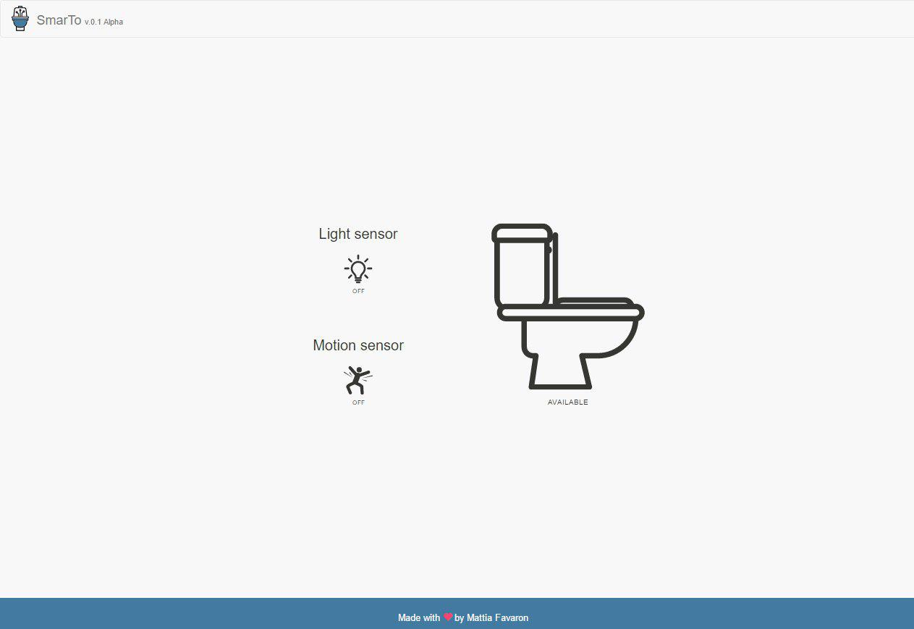
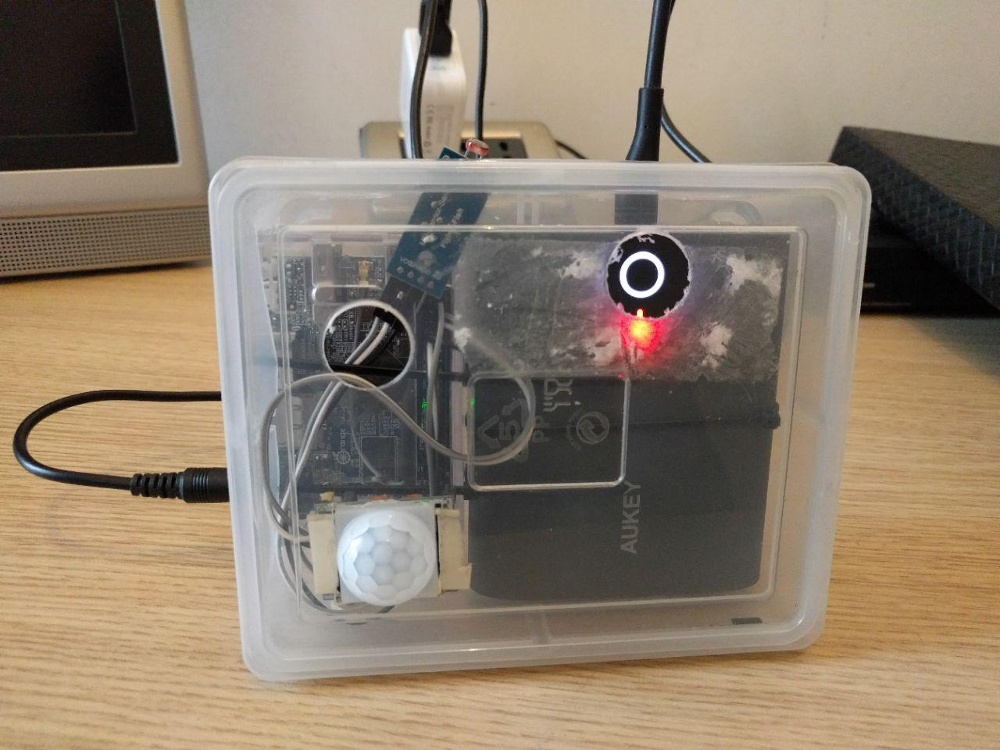

# SmarTo

*SmarTo* is a web application built to make your office life *easier*. With *SmarTo* you can check the toilet availability from the comfort of your PC/SmartPhone.



We installed it in a bathroom with no windows, so the light sensor makes the bulk of the work. The motion sensor comes in handy when someone forgets to turn off the light. 
In fact, if after 10 minutes the light still on and there are no movement inside, SmarTo notifies than maybe the toilet is available.



## What it is made of

### Hardaware

- Single-board computer (es: Raspberry Pi/OrangePi)
- Battery pack
- Photosensitive resistance sensor module
- HC-SR501 Pir Motion Detector - [Doc](https://www.mpja.com/download/31227sc.pdf)
- Jumper Wires x 6

#### Installation

Connect sensors on yours Single-board computer.

Example on Raspberry Model B+:

| Wires color | Description |
| --- | --- |
| Grey | 5v |
| White | Ground |
| Black | Signal |


After that you need to set the select GPIO on _server.js_.

Example with _Raspberry Model B+_ and previews connection:

```javascript
// Set GPIO number
var motionSensor = new Gpio(4, 'in', 'both');
var lightSensor = new Gpio(17,'in', 'both');
```

Raspberry Pi GPIO schema:


### Software

- [AngularJS 1.X](https://angularjs.org/) 
- [Bootstrap 3.X](http://getbootstrap.com/)
- [Node.js 7.X](https://nodejs.org/en/) 
- [Express.js 4.X](http://expressjs.com)

#### Prerequisites

Make sure you have installed all of the following prerequisites on your machine.

- Node.js - [https://github.com/nodesource/distributions](https://github.com/nodesource/distributions)

#### Installation

To install SmarTo's dependencies you are going to use npm. In the application root folder run this in the command-line:

```bash
$ npm install
```

## Running SmarTo

After the install process is over, you'll be able to run *SmarTo*:

```bash
$ node server.js
```

*SmarTo* will be running on port 80, just open your browser and visit _http://raspberry-ip_.

### Forever.js

I also suggest to run the application with [forever](https://github.com/foreverjs/forever).
To do this, type in the command line:

```bash
$ [sudo] npm install -g forever
```

Then go to application root folder and run:

```bash
$ forever start server.js
```

Now *SmarTo* is running _forever_ on server port 80.


## Working on

| Board | OS | Tested |
| --- | --- | --- |
| Raspberry Pi 1 Model B+ | Raspian | NO |
| OrangePi Lite | Armbian | YES |


## Something you have to know

- This is a little project built and develop in a week. Many features are missing and the sensors can still be changed.
- If you like this project, help is always welcome.

## ToDo

- [ ] Rewrite all with modern technologies (ES6, Angular 4, Bootstrap 4)
- [ ] Collect and show statistical data (es: peak hours)
- [ ] Toilet reservation (also with _amazon dash button_)

## Credits
Icon made by [Freepik](http://www.flaticon.com/authors/freepik),  from [www.flaticon.com](www.flaticon.com )

## License

SmarTo's source code is released under [GNU AGPLv3 License](http://www.gnu.org/licenses/agpl-3.0.html).

> SmarTo
>
> Copyright (C) 2017 Mattia Favaron
>
> This program is free software: you can redistribute it and/or modify
> it under the terms of the GNU Affero General Public License as
> published by the Free Software Foundation, either version 3 of the
> License, or (at your option) any later version.
>
> This program is distributed in the hope that it will be useful,
> but WITHOUT ANY WARRANTY; without even the implied warranty of
> MERCHANTABILITY or FITNESS FOR A PARTICULAR PURPOSE. See the
> GNU Affero General Public License for more details.
>
> You should have received a copy of the GNU Affero General Public License
> along with this program. If not, see http://www.gnu.org/licenses/.
